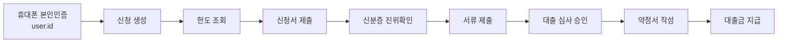

# Kibana 대출 여정 분석

JourneyOps는 API 호출 수가 아니라 완료된 비즈니스 사건을 퍼널 단계로 사용합니다. 재시도나 내부 호출이 늘어나도 동일한 `event.id`와 신청 상태 전이로 중복 사건 생성을 막기 때문에 전환율을 안정적으로 계산할 수 있습니다.

## 기본 검색

```text
Data view: journeyops-*
Domain events: event.dataset : "journeyops.domain-event"
Single application: loan.application.id : "<applicationId>"
Trace correlation: trace.id : "<traceId>"
```

## 퍼널 순서

```text
Funnel order:
loan-application-created
loan-offer-provided
loan-application-submitted
identity-card-verified
loan-documents-submitted
loan-evaluation-approved
loan-contract-signed
loan-payment-completed
```



휴대폰 인증은 신청 생성 이전 사건이라 `loan.application.id`가 아직 없습니다. 따라서 `phone-verification-completed`를 `user.id`로 신청 생성 사건과 연결해 별도 선행 단계로 분석합니다. 원문 전화번호 대신 SHA-256 기반 가명 식별자만 저장합니다.

## 분석 절차

1. `JourneyOps - Loan Journey` 대시보드에서 기간을 선택합니다.
2. `event.action`, `event.outcome`, `service.name`으로 전체 퍼널을 좁힙니다.
3. 이탈한 신청의 `loan.application.id`를 `JourneyOps - Application Timeline`에 입력합니다.
4. 실패 사건의 `trace.id`로 같은 요청에서 발생한 서비스 간 HTTP 로그를 찾습니다.
5. 전화 인증까지 거슬러 올라갈 때만 `user.id`를 사용합니다.

`event.action`은 안정적인 분석 계약이며 URL이나 컨트롤러 이름을 바꾸더라도 유지합니다. `http.request.*`는 성능과 장애 조사에, 도메인 사건은 퍼널과 전환율 계산에 사용합니다.
